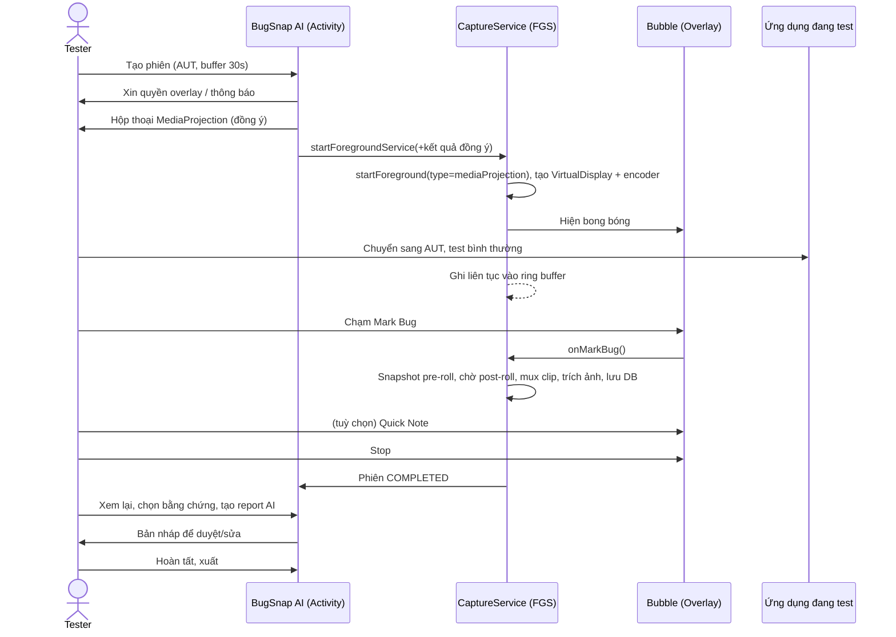
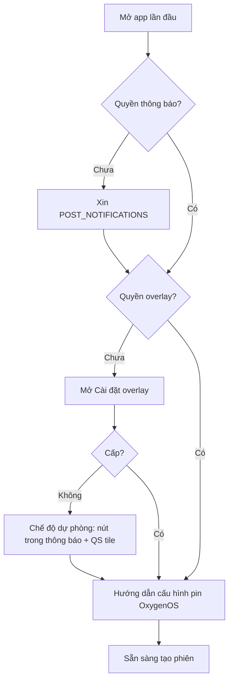
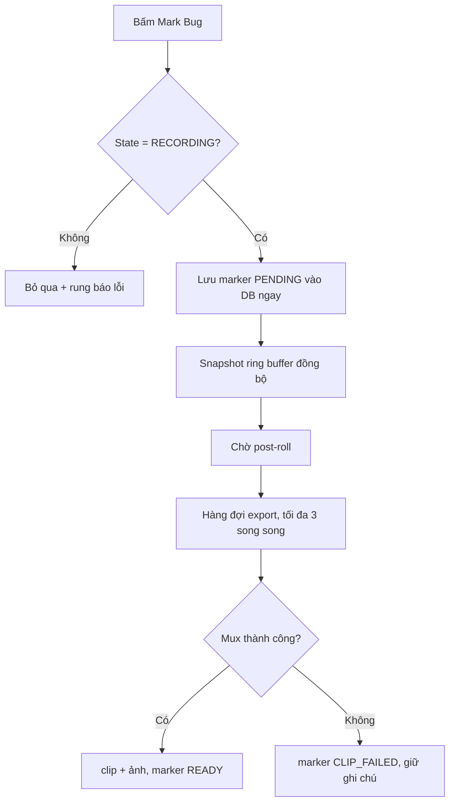
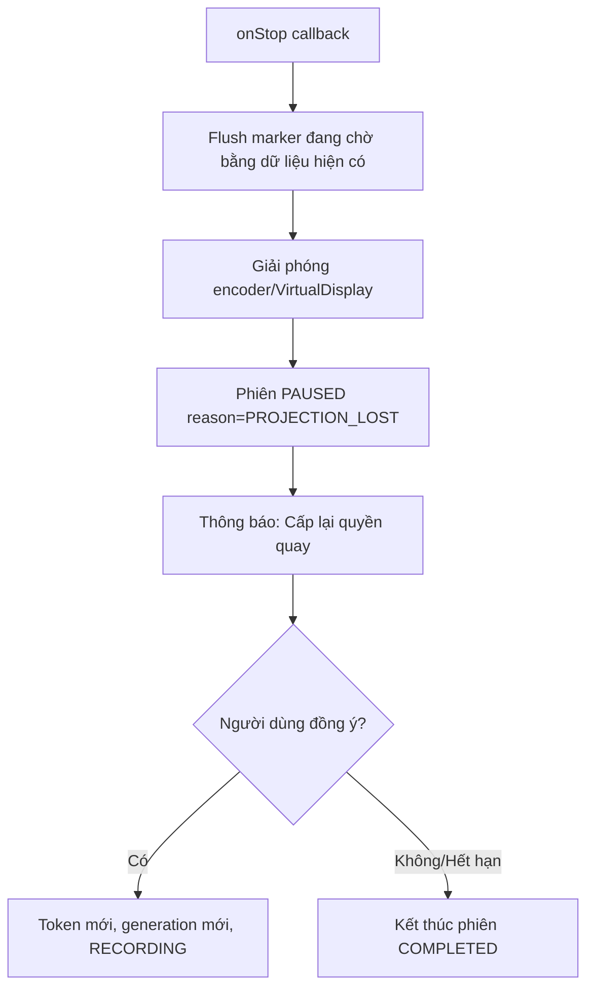
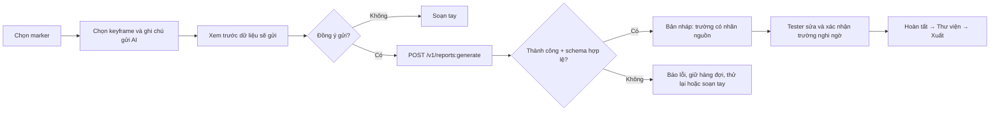

# 04 — Luồng người dùng

## 1. Luồng chính (cùng thiết bị)

```mermaid
sequenceDiagram
    actor T as Tester
    participant App as BugSnap AI (Activity)
    participant Svc as CaptureService (FGS)
    participant B as Bubble (Overlay)
    participant AUT as Ứng dụng đang test
    T->>App: Tạo phiên (AUT, buffer 30s)
    App->>T: Xin quyền overlay / thông báo
    App->>T: Hộp thoại MediaProjection (đồng ý)
    App->>Svc: startForegroundService(+kết quả đồng ý)
    Svc->>Svc: startForeground(type=mediaProjection), tạo VirtualDisplay + encoder
    Svc->>B: Hiện bong bóng
    T->>AUT: Chuyển sang AUT, test bình thường
    Svc-->>Svc: Ghi liên tục vào ring buffer
    T->>B: Chạm Mark Bug
    B->>Svc: onMarkBug()
    Svc->>Svc: Snapshot pre-roll, chờ post-roll, mux clip, trích ảnh, lưu DB
    T->>B: (tuỳ chọn) Quick Note
    T->>B: Stop
    Svc->>App: Phiên COMPLETED
    T->>App: Xem lại, chọn bằng chứng, tạo report AI
    App->>T: Bản nháp để duyệt/sửa
    T->>App: Hoàn tất, xuất
```

## 2. Quyền và onboarding

```mermaid
flowchart TD
    A[Mở app lần đầu] --> B{Quyền thông báo?}
    B -- Chưa --> B1[Xin POST_NOTIFICATIONS] --> C
    B -- Có --> C{Quyền overlay?}
    C -- Chưa --> C1[Mở Cài đặt overlay] --> C2{Cấp?}
    C2 -- Không --> D[Chế độ dự phòng: nút trong thông báo + QS tile]
    C2 -- Có --> E
    C -- Có --> E[Hướng dẫn cấu hình pin OxygenOS]
    D --> E
    E --> F[Sẵn sàng tạo phiên]
```

## 3. Mark Bug và marker liên tiếp

```mermaid
flowchart TD
    M[Bấm Mark Bug] --> S{State = RECORDING?}
    S -- Không --> X[Bỏ qua + rung báo lỗi]
    S -- Có --> P[Lưu marker PENDING vào DB ngay]
    P --> Q[Snapshot ring buffer đồng bộ]
    Q --> W[Chờ post-roll]
    W --> E[Hàng đợi export, tối đa 3 song song]
    E --> OK{Mux thành công?}
    OK -- Có --> D[clip + ảnh, marker READY]
    OK -- Không --> F[marker CLIP_FAILED, giữ ghi chú]
```

## 4. Mất MediaProjection

```mermaid
flowchart TD
    A[onStop callback] --> B[Flush marker đang chờ bằng dữ liệu hiện có]
    B --> C[Giải phóng encoder/VirtualDisplay]
    C --> D[Phiên PAUSED reason=PROJECTION_LOST]
    D --> E[Thông báo: Cấp lại quyền quay]
    E --> F{Người dùng đồng ý?}
    F -- Có --> G[Token mới, generation mới, RECORDING]
    F -- Không/Hết hạn --> H[Kết thúc phiên COMPLETED]
```

## 5. Tạo và duyệt report

```mermaid
flowchart LR
    A[Chọn marker] --> B[Chọn keyframe và ghi chú gửi AI]
    B --> C[Xem trước dữ liệu sẽ gửi]
    C --> D{Đồng ý gửi?}
    D -- Không --> E[Soạn tay]
    D -- Có --> F[POST /v1/reports:generate]
    F --> G{Thành công + schema hợp lệ?}
    G -- Có --> H[Bản nháp: trường có nhãn nguồn]
    G -- Không --> I[Báo lỗi, giữ hàng đợi, thử lại hoặc soạn tay]
    H --> J[Tester sửa và xác nhận trường nghi ngờ]
    J --> K[Hoàn tất → Thư viện → Xuất]
```
